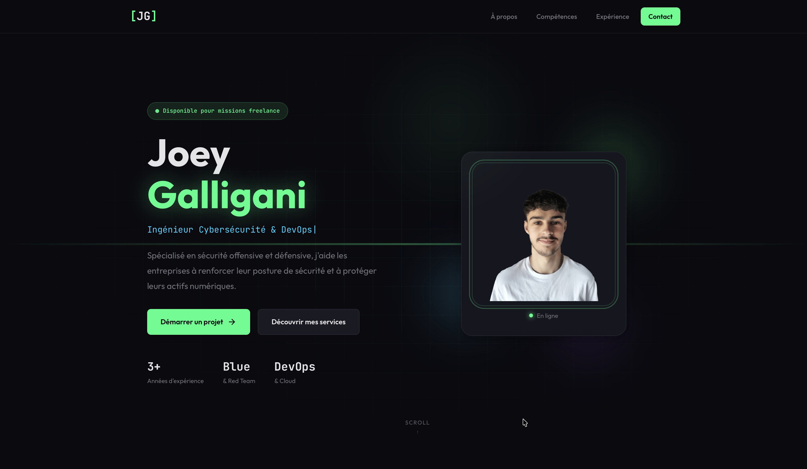

# Joey Galligani - Portfolio Freelance

[](https://joey-galligani.github.io/site-vitrine)
[](LICENSE)

A modern, responsive portfolio website showcasing cybersecurity and DevOps freelance services. Built with vanilla HTML, CSS, and JavaScript for optimal performance and maintainability.



## ✨ Features

- **Modern Dark Theme** - Cybersecurity-inspired aesthetic with neon accents
- **Fully Responsive** - Optimized for all devices and screen sizes
- **Smooth Animations** - Scroll-triggered effects and micro-interactions
- **Performance Focused** - No frameworks, minimal dependencies
- **SEO Optimized** - Semantic HTML and meta tags
- **Accessible** - WCAG compliant with proper ARIA labels

## 🛠️ Tech Stack

- HTML5 (Semantic markup)
- CSS3 (Custom properties, Grid, Flexbox)
- Vanilla JavaScript (ES6+)
- Google Fonts (JetBrains Mono, Outfit)

## 📁 Project Structure

```
site-vitrine/
├── index.html          # Main HTML file
├── styles.css          # All styles
├── script.js           # JavaScript functionality
├── assets/
│   └── profile.png     # Profile image
├── README.md           # This file
├── LICENSE             # MIT License
└── .gitignore          # Git ignore rules
```

## 🚀 Getting Started

### Option 1: Direct Opening

Simply open `index.html` in your browser.

### Option 2: Local Server

For development with live reload:

```bash
# Using Python
python -m http.server 8000

# Using Node.js (npx)
npx serve
```

Then navigate to `http://localhost:8000`

## 🎨 Customization

### Colors

Edit CSS custom properties in `styles.css`:

```css
:root {
    --color-primary: #00ff88;    /* Main accent color */
    --color-accent: #00d4ff;     /* Secondary accent */
    --color-bg: #0a0a0f;         /* Background */
    /* ... */
}
```

### Content

Update personal information directly in `index.html`:
- Hero section text
- Skills and expertise
- Experience timeline
- Contact information

### Profile Image

Replace `assets/profile.png` with your own photo (recommended: 280x280px minimum).

## 📱 Browser Support

- Chrome 88+
- Firefox 85+
- Safari 14+
- Edge 88+

## 📄 License

This project is licensed under the MIT License - see the [LICENSE](LICENSE) file for details.

## 👤 Author

**Joey Galligani**

- GitHub: [@Joey-Galligani](https://github.com/Joey-Galligani)
- LinkedIn: [joey-galligani](https://linkedin.com/in/joey-galligani)
- Email: galliganijoey@gmail.com

---

<p align="center">
  Made with ❤️ and ☕ in Montpellier, France
</p>
